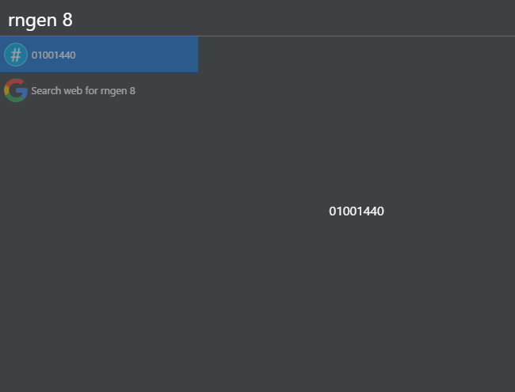

# Cerebro-random-number

> [Cerebro](http://www.cerebroapp.com) plugin for generating a random number.

## Usage

 Just type ```rngen``` in the cerebro box.

 Optionally you can pass the required character length of the number as an argument.

 Example:

 ```
 rngen 8
 ```

 By default, the generated number will be 4 characters in length.

 The resulting number is copied to the clipboard.

 


## Related

* [Cerebro](http://github.com/KELiON/cerebro) – Main repo for the Cerebro app.
* [Create-cerebro-plugin](https://github.com/KELiON/create-cerebro-plugin) – Boilerplate to creating Cerebro plugins.

## License
MIT © [5urpher](https://github.com/5urpher)